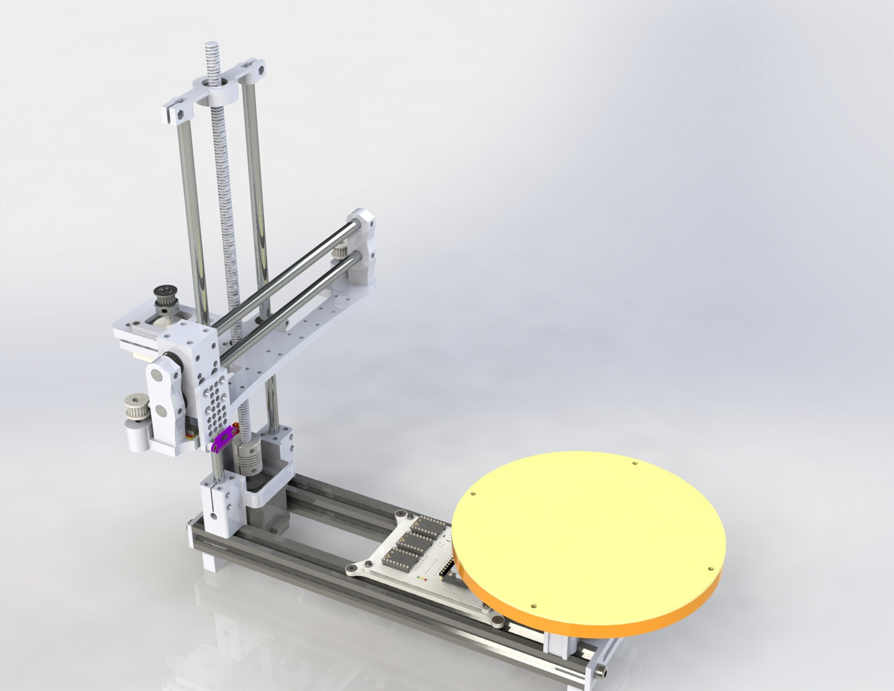
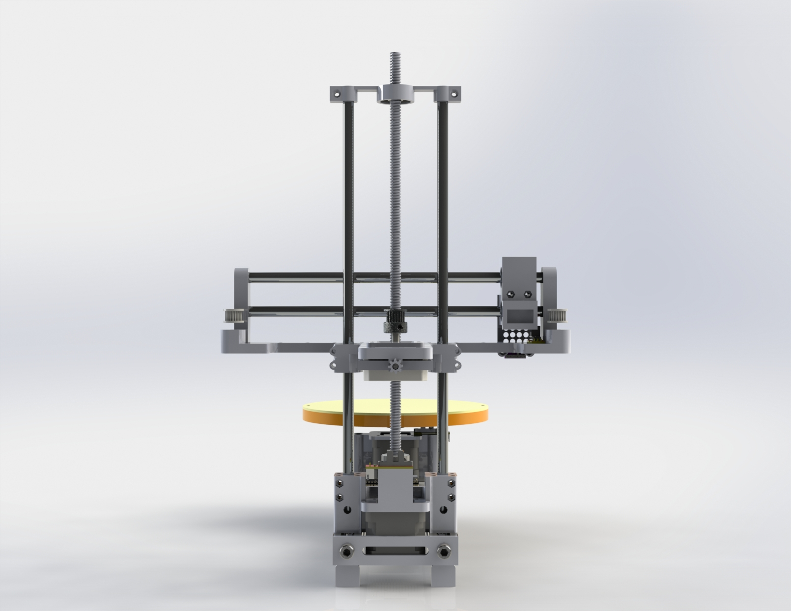

<h1 align="center">ESP32 3D Scanner</h1>
This is a fork of marline firmware, that I used to run on ESP32 to build a 3D scanner using ToF concept. The work still in progress. The current status and to-do list:

 - 1st version of PCB bring up [Done]
 - Mechanical Parts for 3 Steppers [Done]
 - Custom Gcode for obtaining TOF value "G200" using Adafruit library [Done]
 - Checking usb connection for Octoprint and other serial applications [Done]
 - Enable wifi to be independet of the usb cable [ ]
 - Finalize mechanincal desing [ ]
 - Checking the distance vs accuaracy [ ]
 - 2nd version of PCB [ ]
 - Publishing STLs, PCB and BOM [ ]
 - Algorithm for scanning an object converting to 3D grid and the to STL [ ]
